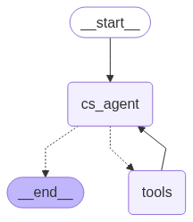

# ☕ ZUS Coffee Chatbot API (LLM + FastAPI)

A chatbot API that answers questions about ZUS Coffee's products and outlets using RAG and Text2SQL, powered by LangChain and FastAPI.

---

## Features

- Sequential Conversation
- Agentic Planning
- Tool Calling
- Custom API & RAG Integration
- Unhappy Flows

---

## Scraping Tools

-scrapper_dynamic
Product scrapper using LLM model to extarct important information from the webpage and giving the products descriptions for vector db query

-scrapper_outlets
Multipage scraping and storing data into SQLite

## Graph Flow


## Models Used (GROQ API)
- meta-llama/llama-4-maverick-17b-128e-instruct
- llama-3.3-70b-versatile
Other models seem to have trouble with memory and multi tool calls
  
## 🛠️ Setup

```bash
# Clone the repo
git clone https://github.com/yourusername/zus-chatbot

# Go into the folder
cd basic_chatbot

# Create .env file and enter your GROQ API Keys
GROQ_API_KEY = "YOUR_API_KEYS"

# Install dependencies
pip install -r requirements.txt

# Run the FastAPI server
python main.py #(Run API server for product and outlets)
python chat_api.py #(Run API server for chatbot/customer service agent)


# Run the Chatbot interface
python -m http.server 3000

# Go to
http://localhost:3000/chat.html
